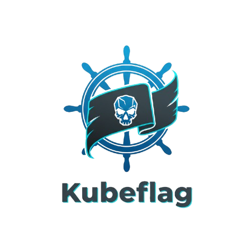

# 🏴 Kubeflag

  

**Kubeflag** is a Kubernetes-native orchestration platform for managing and provisioning Capture-The-Flag (CTF) challenge environments.  
It provides a secure, multi-tenant API that allows CTF platforms (like [CTFd](https://ctfd.io/)) to dynamically create, manage, and destroy challenge instances inside Kubernetes clusters.

Kubeflag bridges the gap between **CTF event platforms** and **Kubernetes infrastructure**, giving each participant a fully isolated, automatically provisioned environment — all through declarative APIs.

---

## ✨ Key Features

- **Declarative CRDs** -  `Challenge`, `ChallengeInstance`, `Tenant`, `Consumer`.
- **Challenge Orchestration** — Define reusable challenge templates with a `Challenge` CRD.
- **Automatic Namespace Isolation** — Each challenge have its own namespace.
- **Data Synchronization** — Sync Secrets and ConfigMaps automatically across namespaces.
- **Multi-Tenancy** — Use `Tenant` CRDs to enforce resource and policy boundaries.
- **External API Integration** — External platforms communicate through the Kubeflag API.
- **Token-Based Authentication** — Consumers (like CTFd) authenticate using generated tokens.
- **Webhook Validation/Mutation** — Enforce rules and policies during CRD lifecycle events.

---

## 🏗️ Architecture Overview