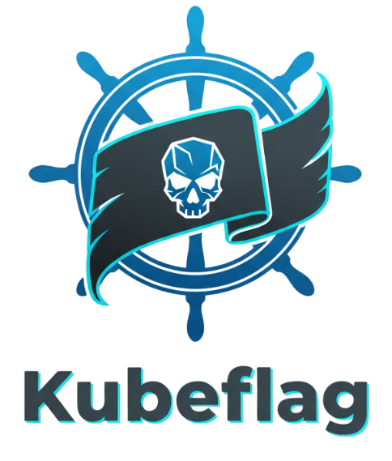
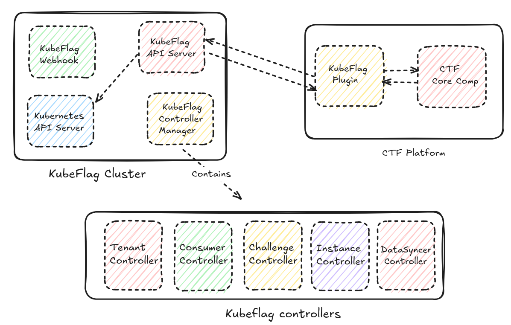

# 🏴 Kubeflag


<div align="center">
  
</div>


**Kubeflag** is a Kubernetes-native orchestration platform for managing and provisioning Capture-The-Flag (CTF) challenge environments.  
It provides a secure, multi-tenant API that allows CTF platforms (like [CTFd](https://ctfd.io/)) to dynamically create, manage, and destroy challenge instances inside Kubernetes clusters.

Kubeflag bridges the gap between **CTF event platforms** and **Kubernetes infrastructure**, giving each participant a fully isolated, automatically provisioned environment — all through declarative APIs.


---

## ✨ Key Features

- **Declarative CRDs** -  `Challenge`, `ChallengeInstance`, `Tenant`, `Consumer`.
- **Challenge Orchestration** — Define reusable challenge templates with a `Challenge` CRD.
- **Automatic Namespace Isolation** — Each challenge have its own namespace.
- **Data Synchronization** — Sync Secrets and ConfigMaps automatically across namespaces.
- **Multi-Tenancy** — Use `Tenant` CRDs to enforce resource and policy boundaries.
- **External API Integration** — External platforms communicate through the Kubeflag API.
- **Token-Based Authentication** — Consumers (like CTFd) authenticate using generated tokens.
- **Webhook Validation/Mutation** — Enforce rules and policies during CRD lifecycle events.

---

## 🏗️ Architecture Overview

<div align="center">
  
</div>

### 🧠 Key Concepts

| CRD | Scope | Description |
|-----|--------|-------------|
| **Tenant** | Cluster-scoped | Represents a event, or organization. Defines policies like the max number of running instances per user/team. |
| **Challenge** | Cluster-scoped | Template definition of a challenge, including PodSpec, configuration references, and associated tenant. |
| **ChallengeInstance** | Namespaced | Represents a live running instance of a challenge. Automatically deployed and exposed (NodePort by default). |
| **Consumer** | Cluster-scoped | Represents an API consumer (e.g., a CTFd plugin). Each consumer has a token to authenticate API requests. |


Kubeflag consists of several core components working together:

| Component | Description |
|------------|-------------|
| **Controller Manager** | Runs multiple reconcilers that manage tenants, challenges, challenge instances, and data synchronization. |
| **API Server** | The main API interface — used by external platforms (like [CTFd](https://ctfd.io)) or custom plugins to create/delete challenge instances. |
| **Webhook Server** | Handles validation and mutation logic for all CRDs to enforce policies and maintain data integrity. |

kubeflag introduces a multi-tenant model where different **Consumers** (such as CTF events or integrations) can safely request isolated challenge instances based on defined **Tenants** and **Policies**.


---

## ⚙️ Installation

We **strongly recommend** using an official release of kubeflag.  
Each release is tested and packaged as a **Helm chart** for easy deployment.

To install kubeflag:


```bash
helm repo add kubeflag https://kubeflag.github.io/helm-charts
helm install kubeflag kubeflag/kubeflag --namespace kubeflag-system --create-namespace
```

The code and sample YAML files in the main branch of this repository are under active development
and are **not guaranteed to be stable**. Use them **at your own risk**.

## 📘 More Information

For more information on how to:

- Configure **kubeflag** and its CRDs  
- Create and manage **Challenges**  
- Define **Challenge Templates** and data references  
- Build **multi-container** challenge setups  
- Install and integrate the **CTFd plugin example**  
- Learn advanced concepts like Tenant isolation, Consumer tokens, and API permissions  

👉 Visit the official **[Documentation Website](https://kubeflag.io/docs)** for detailed guides, examples, and tutorials.

---

## 🤝 Contributing

We welcome all forms of contribution — whether it’s:
- Reporting bugs 🐛  
- Improving documentation 📖  
- Proposing new ideas 💡  
- Submitting pull requests 🔧  

Please read our **[CONTRIBUTING.md](CONTRIBUTING.md)** (coming soon) before submitting your first PR.  
You can also participate in discussions through GitHub Issues or the upcoming community Slack/Discord channel.

If you have feature requests or feedback, open an issue with the label `enhancement`.

---

## 🧑‍💻 Development Guide

> **T.B.D**  
The development guide will include details on how to:
- Set up a local development environment  
- Run the controller manager and webhook server locally  
- Test kubeflag CRDs with [kind](https://kind.sigs.k8s.io/) or [minikube](https://minikube.sigs.k8s.io/)  
- Debug controllers and reconcile loops  
- Contribute code and follow repository conventions  

Stay tuned — this section will be updated once the first developer preview is ready.

---

## 📜 License

kubeflag is released under the **Apache 2.0 License**.  
See [LICENSE](LICENSE) for more information.

---

<div align="center">
Made with ❤️ by <a href="https://github.com/mohamedrafraf">Mohamed Rafraf</a> and the community.
</div>
